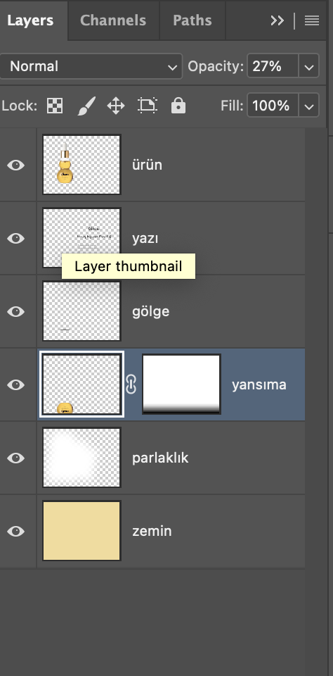
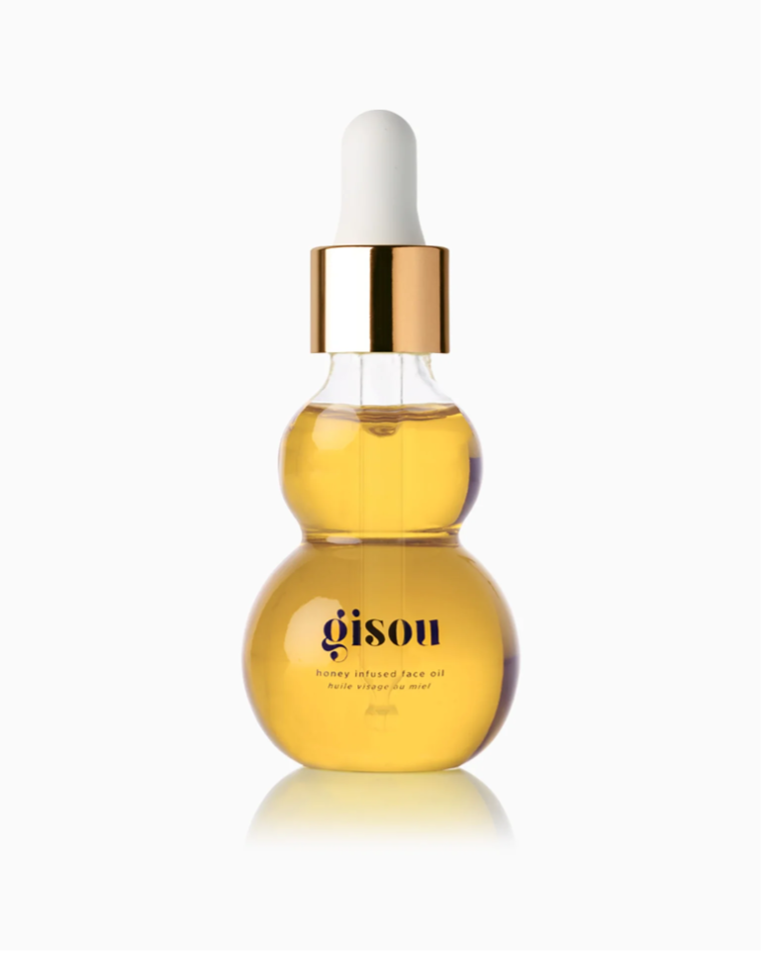
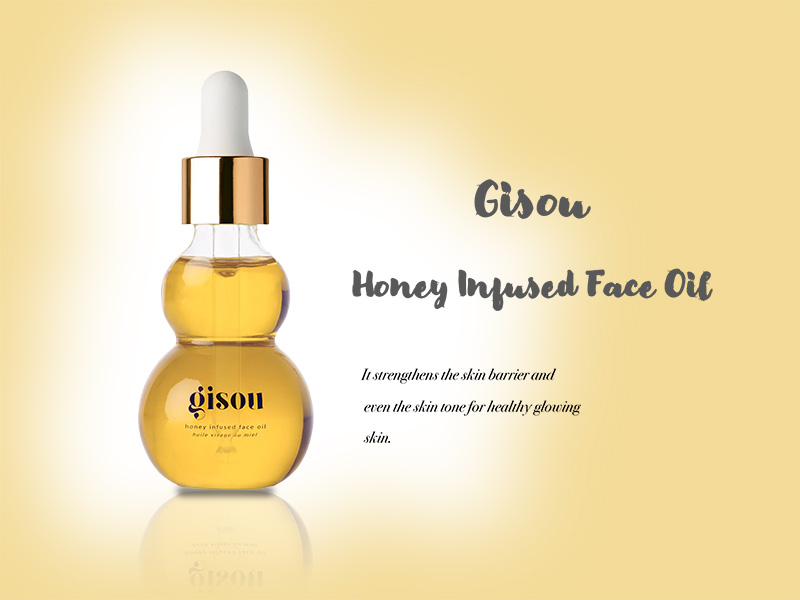

# Ürün Tanıtımı — Gisou Face Oil

Bu proje, **Adobe Photoshop** kullanılarak hazırlanmış bir ürün tanıtım tasarımıdır.  
Amaç, markanın doğal ve parlak görsel kimliğini vurgularken sade bir premium atmosfer oluşturmaktır.

---

# Katman Yapısı (Layers)
Tasarım; gerçekçi ışık ve gölge dengesiyle derinlik kazandırmak için çok katmanlı olarak düzenlenmiştir:

# Görseller

   
  <em>Katman yapısı — Katman düzeni</em>  
  
   
  <em>Düzenleme öncesi görünüm</em> 
  
   
  <em>Son hali — Ürün tanıtım afişi</em>

---

# Kullanılan Araçlar
- **Adobe Photoshop CC**
- **Layer blending modes**
- **Opacity & gradient mask kullanımı**
- **Gölge, yansıma ve parlaklık efektleri**

# Geliştirici
**Hatice Polat**  
🎓 Akdeniz Üniversitesi — Yönetim Bilişim Sistemleri  
🔗 [LinkedIn](https://linkedin.com/in/haticepolatt)
